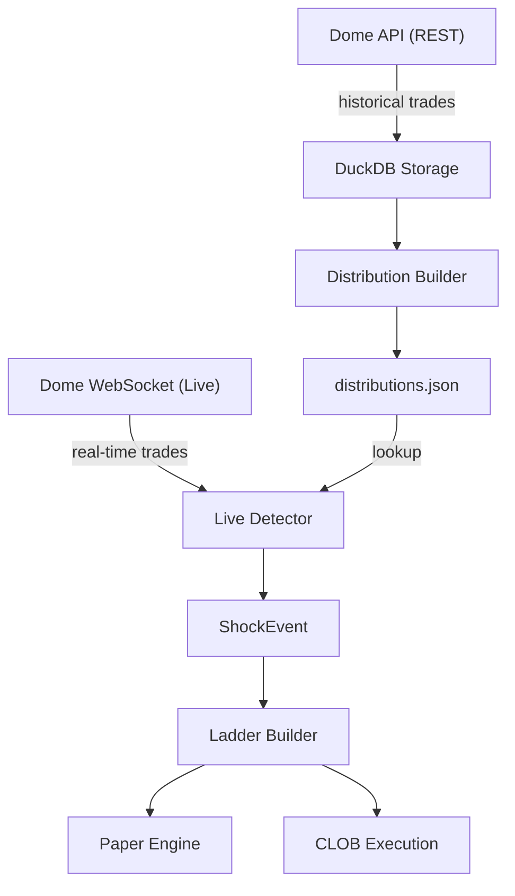

# FIFA World Cup Shock Trading Bot

An automated Polymarket trading system for the 2026 FIFA World Cup, implementing
the shock-recovery strategy described in `Article`.

The strategy does **not** predict goals. It waits for the market to overreact to
a match event (a goal, red card, missed penalty), measures how deep that *specific
type* of shock has historically gone using a five-dimension classification system,
and places laddered limit buy orders to capture the statistical recovery.

> Trading prediction markets risks real capital. This software defaults to paper
> mode. Backtest thoroughly before enabling live trading.

## How it works

1. **Detect** a shock: inside a 2-minute sliding window, the price drops >= 15%
   peak-to-floor, the absolute drop is >= 8c, and the market is not within a
   3-minute cooldown of a previous shock.
2. **Classify** the shock across five dimensions into a bucket key, e.g.
   `deep|underdog|balanced|mid|level`:
   - League tier (`deep` / `thin` / `unknown`)
   - Favoritism from pre-shock price (`heavy_fav` / `moderate_fav` / `slight_fav` / `balanced` / `underdog`)
   - Order-book depth (`top_heavy` / `balanced` / `deep_liq` / `unknown`)
   - Match time (`early` / `mid` / `late` / `final`)
   - Goal state (`level` / `close` / `comfortable` / `blowout`)
3. **Look up** the historical depth distribution (P50/P75/P90/P95) for that bucket.
   Buckets with fewer than 5 historical shocks fall back to conservative defaults.
4. **Ladder** four limit buys at increasing depth with increasing weight
   (10% / 20% / 30% / 40%), each priced at `pre_price - percentile_depth`.
5. **Capture** the recovery: exit each fill at +4c.



## Project layout

| Path | Purpose |
| --- | --- |
| `config.py` | Central config and strategy parameters (loaded from `.env`) |
| `data/` | Pydantic models, Polymarket + Dome API clients, DuckDB storage |
| `classifier/` | Shock detection + five-dimension classifiers + bucket key |
| `distributions/` | Historical distribution builder and JSON store |
| `detector/` | Sliding window + real-time shock detector |
| `execution/` | Ladder builder, paper engine, live CLOB execution |
| `backtest/` | End-to-end pipeline replay + per-bucket performance report |
| `main.py` | CLI entry point |
| `tests/` | Test suite (pytest) |

## Setup

```bash
python3 -m venv .venv
source .venv/bin/activate
pip install -r requirements.txt
cp .env.example .env   # then fill in your API keys
```

Required environment variables (see `.env.example`):

- Data ingestion uses Polymarket's public APIs and needs **no key**.
- `POLYMARKET_API_KEY` / `_SECRET` / `_PASSPHRASE` - only needed for live order placement.
- `DOME_API_KEY` - only needed if you use `--source dome`.
- `PAPER_MODE` - `true` (default) keeps you in paper mode; live trading requires `false`.
- `CAPITAL_PER_SHOCK` - dollar budget allocated across the ladder per shock.
- `DATA_SOURCE` - default data source (`polymarket` or `dome`); defaults to `polymarket`.

## Data source

The default data source is **Polymarket's native public APIs** (no auth needed
for reads). Select with `--source polymarket` (default) or `--source dome`.

| Surface | Base URL | Used for |
| --- | --- | --- |
| Gamma | `https://gamma-api.polymarket.com` | Market discovery (`/markets`): slugs, `conditionId`, `clobTokenIds` |
| Data | `https://data-api.polymarket.com` | Historical trade fills (`/trades`) |
| CLOB | `https://clob.polymarket.com` | Order book (`/book`), prices history (`/prices-history`), live WS |

## Usage

```bash
# 1. Ingest historical football trades from Polymarket into the local DuckDB store.
#    Discovers markets per soccer league via numeric tag ids (far fewer false
#    positives than the generic "soccer" tag) and pulls each market's trade fills
#    from the Data API. --max-markets caps markets PER LEAGUE; caps keep runs fast.
python main.py --mode ingest --source polymarket --status closed \
    --max-markets 50 --max-trades 5000
# Restrict to specific leagues:
python main.py --mode ingest --leagues premier-league la-liga fifa-world-cup \
    --status closed

# 2. Build the historical depth distributions
python main.py --mode build

# 3. Backtest across all buckets and review per-bucket win rates
python main.py --mode backtest

# 4. Run live in paper mode (no real capital); subscribes to the CLOB market WS
python main.py --mode paper --source polymarket --tag-slug soccer

# 5. Only once backtests are convincing AND PAPER_MODE=false:
python main.py --mode live --source polymarket --tag-slug soccer
```

### How ingestion (step 1) works

`--mode ingest` runs `cmd_ingest` in [main.py](main.py) against
[data/polymarket_client.py](data/polymarket_client.py):

1. **Discover** markets per league. Gamma's `/markets` ignores `tag_slug` but
   honors a numeric `tag_id`, so each league slug in `--leagues` is resolved via
   `GET /tags/slug/<slug>` (e.g. `premier-league` -> `82`) and then queried with
   `GET /markets?tag_id=<id>&closed=true`. Results are deduped across leagues.
   `clobTokenIds` and `outcomes` are double-encoded JSON strings (parsed for you);
   `clobTokenIds` is index-matched to `outcomes`, giving each outcome's `token_id`.
2. **Pull trades** for each market via Data API `GET /trades?market=<conditionId>`,
   following offset pagination. Every fill carries `asset` (token id), `price`,
   `size` and `timestamp` (Unix seconds).
3. **Normalize** each fill into a `Trade` (`market_id = token_id`,
   `slug = market_slug`, timestamps converted to ms) and store it in DuckDB so
   `--mode build` / `--mode backtest` can replay it.

Notes:
- League discovery is driven by `config.SOCCER_LEAGUE_TIERS`, which maps each
  league slug to a depth tier (`deep` for major leagues like the EPL / La Liga /
  Champions League / World Cup, `thin` for minor ones like Norway Eliteserien).
  Soccer market slugs do not contain the league, so ingestion annotates the
  stored slug as `"<league-slug>/<market-slug>"` and `classify_league` reads the
  tier from that. Add or retier leagues by editing `SOCCER_LEAGUE_TIERS`.
- Polymarket exposes no historical order book, so `classify_depth` resolves to
  `unknown` for backtests. The live order book (`/book`) is used for live paper /
  real trading, where depth classification is meaningful.

### Dome fallback

`--source dome` uses the [Dome API](https://docs.domeapi.io) (REST base
`https://api.domeapi.io/v1`, `x-api-key` header, WS `wss://ws.domeapi.io/<key>`,
timestamps in Unix seconds). Note Dome announced end-of-life on **April 28, 2026**;
its data endpoints may be unresponsive even though auth still validates. Prefer
Polymarket.

## Testing

```bash
pytest -q
```

## Strategy tuning

The percentile bands and weights are a strong starting point, not a fixed recipe.
Use the backtester's per-bucket report to find the most profitable segments (the
article notes `moderate_fav` outperformed) and consider filtering to deeper
percentile ranges before kickoff.

Exit behaviour is controlled by two parameters in `config.py`:

- `EXIT_CENTS` — **take profit**: a filled position is sold once price recovers
  this many cents above the fill (default `0.04`).
- `STOP_LOSS_CENTS` — **stop loss**: a filled position is cut once price falls
  this many cents below the fill (default `0.08`); set to `None` to disable and
  ride positions to end-of-data settlement instead.

A filled order therefore resolves as `exited` (take-profit win), `stopped`
(stop-loss cut) or, in the backtest, `settled` (marked to the last price when the
market's data ends). All three count as realized exits in the win-rate report.

## Notes & caveats

- Dome endpoint paths and WebSocket schema should be verified against the live
  Dome docs before going live; the client tolerates several common envelopes and
  the base URLs are configurable via `DOME_BASE_URL` / `DOME_WS_URL`.
- The backtester evaluates fills on trades arriving *after* a shock is detected,
  which biases results slightly pessimistic (the safe direction).
- Discovery restricts to `sports_market_types=moneyline` and validates that each
  match has the full 3-way outcome set (team A win / team B win / draw), grouping
  by Gamma event. This keeps only true match-outcome markets and drops spreads,
  totals, player props and incomplete groups. Pass `--all-market-types` to keep
  every market type.
- At the end of each market's data the backtest **settles** any still-open
  position at the last observed price (mark-to-market). Without this, every
  filled order eventually hits the +`EXIT_CENTS` target and the report shows a
  100% win rate; settlement realizes the losers (prices that never recovered or
  resolved toward 0) so the per-bucket win rate is meaningful.
- Live execution wraps `py-clob-client`; live order placement paths require real
  credentials and are not exercised by the test suite.
